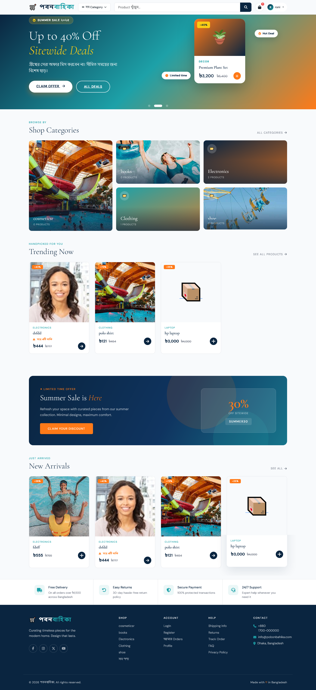
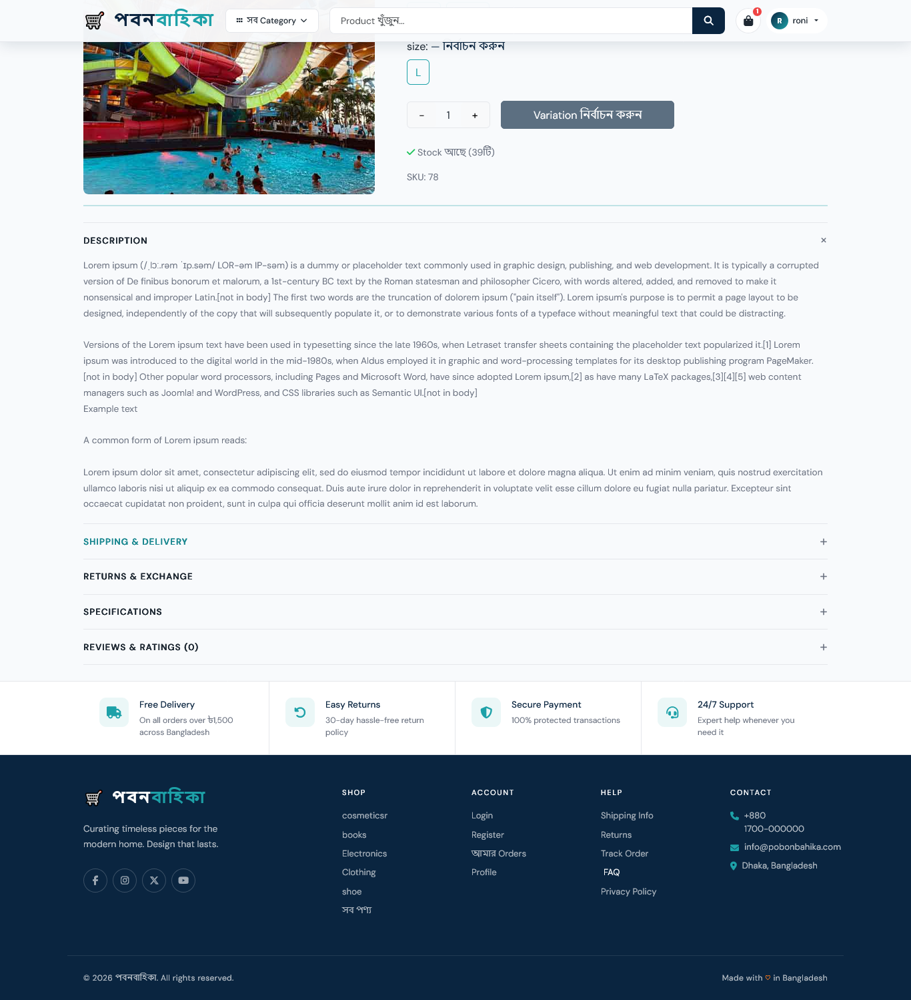
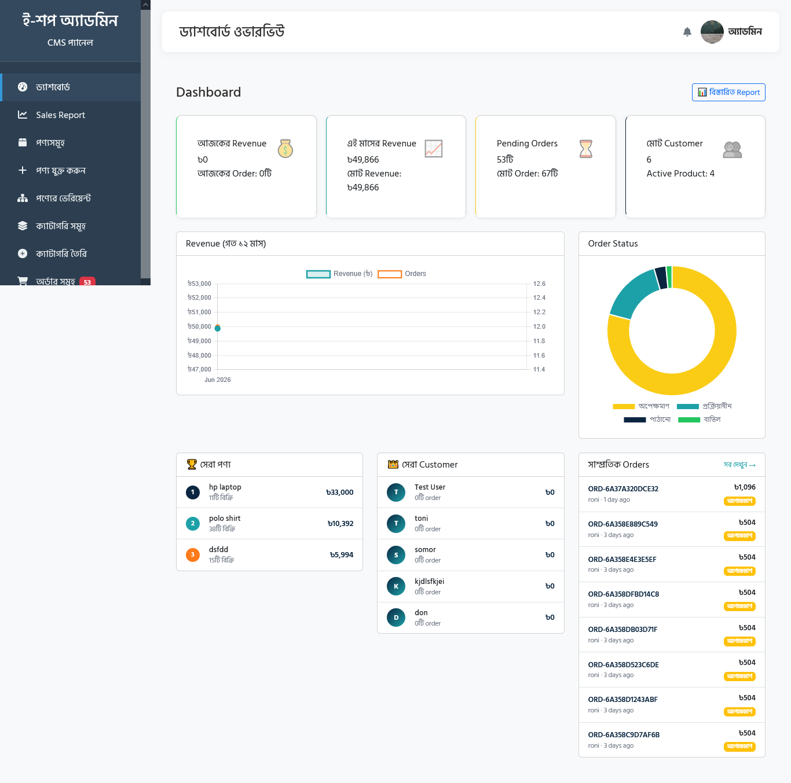
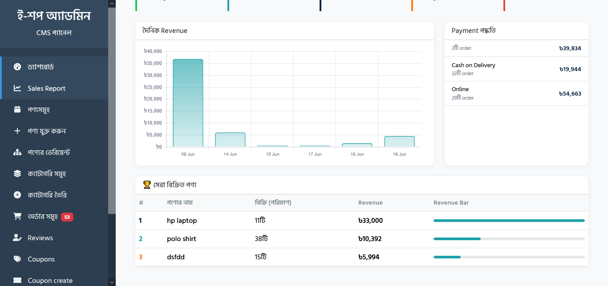

# পবনবাহিকা — E-Commerce Platform

A full-featured e-commerce platform built with Laravel, Bootstrap, and MySQL. Designed for the Bangladeshi market with local payment gateway support, Bengali language interface, and a clean admin panel.

---

## Table of Contents

- [Features](#features)
- [Tech Stack](#tech-stack)
- [Getting Started](#getting-started)
- [Configuration](#configuration)
- [Project Structure](#project-structure)
- [Screenshots](#screenshots)
- [Roadmap](#roadmap)
- [License](#license)

---

## Features

### Storefront
- Responsive shop layout with sticky navbar and mega menu
- Homepage with hero section, featured products, and promotional banner
- Category browsing with nested subcategories (unlimited depth)
- Product detail page with image gallery, variant selector, and accordion
- Real-time cart with AJAX quantity update — no page reload
- Checkout with shipping info and multiple payment methods
- Customer order history, order tracking, and profile management
- Product reviews with star rating and breakdown chart
- Coupon code system at checkout

### Admin Panel
- Dashboard with revenue charts (Chart.js), order status breakdown, top products and customers
- Sales report with custom date range filter and daily revenue bar chart
- Category management with drag-and-drop reorder (SortableJS)
- Product management with multi-image upload, variant builder, and per-variant images
- Order management with status and payment status control, stock auto-restore on cancel
- Coupon management with fixed/percent types, usage limits, and expiry dates
- Customer management with ban/unban, order history per user
- Review moderation with approve/reject

### Technical
- Payment via **SSLCommerz** (supports bKash, Nagad, card, net banking)
- Transactional emails using Laravel Mail (order confirm, status updates)
- Invoice PDF generation with DomPDF
- Product and category cache with automatic invalidation on model events
- Database indexes on high-traffic query columns
- Queue-ready mail with `ShouldQueue`

---

## Tech Stack

| Layer | Choice |
|---|---|
| Framework | Laravel 11 |
| Database | MySQL 8 |
| Frontend | Bootstrap 5.3, Vanilla JS |
| Charts | Chart.js 4 |
| PDF | barryvdh/laravel-dompdf |
| Payment | SSLCommerz (raziul/sslcommerz-laravel) |
| Drag & Drop | SortableJS |
| Icons | Bootstrap Icons |
| Fonts | Cormorant Garamond, DM Sans |
| Queue | Database (upgradeable to Redis) |

---

## Getting Started

### Requirements

- PHP 8.2+
- Composer
- MySQL 8.0+
- Node.js 18+ (optional, for asset compilation)

### Installation

**1. Clone the repository**

```bash
git clone https://github.com/dev-roni/Laravel-Ecommerce.git
cd pobonbahika
```

**2. Install PHP dependencies**

```bash
composer install
```

**3. Environment setup**

```bash
cp .env.example .env
php artisan key:generate
```

**4. Configure your `.env`**

```env
APP_NAME=পবনবাহিকা
APP_URL=http://localhost:8000

DB_DATABASE=pobonbahika
DB_USERNAME=root
DB_PASSWORD=

MAIL_MAILER=smtp
MAIL_HOST=smtp.gmail.com
MAIL_PORT=587
MAIL_USERNAME=your@gmail.com
MAIL_PASSWORD=your_app_password
MAIL_FROM_ADDRESS=your@gmail.com
MAIL_FROM_NAME="পবনবাহিকা"

SSLCOMMERZ_STORE_ID=your_store_id
SSLCOMMERZ_STORE_PASSWORD=your_store_password
SSLCOMMERZ_SANDBOX=true

QUEUE_CONNECTION=database
CACHE_DRIVER=file
```

**5. Run migrations and seeders**

```bash
php artisan migrate
php artisan db:seed
```

**6. Create storage symlink**

```bash
php artisan storage:link
```

**7. Start the development server**

```bash
php artisan serve
```

Visit `http://localhost:8000`

---

## Default Credentials

After seeding, you can log in with:

| Role | Email | Password |
|---|---|---|
| Admin | dev.ronisingha@gmail.com | 12345678 |
| Customer | tonisingha@gmail.com | 12345678 |

> Change these immediately in a production environment.

---

## Configuration

### Payment Gateway

This project uses [SSLCommerz](https://developer.sslcommerz.com) for payment processing.

1. Register at `https://developer.sslcommerz.com/registration/` for a sandbox account
2. Add your Store ID and Password to `.env`
3. Set `SSLCOMMERZ_SANDBOX=false` when going live

SSLCommerz supports bKash, Nagad, Rocket, all major credit/debit cards, and net banking out of the box — no separate integration needed for each.

### Mail

For Gmail, you need to generate an **App Password** (not your regular password):

```
Google Account → Security → 2-Step Verification → App Passwords
```

For production, consider [Mailgun](https://mailgun.com) or [Amazon SES](https://aws.amazon.com/ses/) for better deliverability.

### Queue

By default the project uses the database queue driver. To process jobs:

```bash
php artisan queue:work
```

For production, use a process manager like Supervisor to keep the worker running.

---

## Project Structure

```
app/
├── Http/
│   ├── Controllers/
│   │   ├── Admin/          # Admin panel controllers
│   │   └── ...             # Frontend controllers
│   ├── Middleware/
│   │   ├── AdminMiddleware.php
│   │   └── CheckBanned.php
│   └── Requests/           # Form request validation
├── Mail/                   # Mailable classes
├── Models/                 # Eloquent models
├── Observers/              # Model observers (cache invalidation)
└── Services/
    ├── CartService.php
    └── CouponService.php

resources/views/
├── admin/                  # Admin panel views
├── emails/                 # Email templates
├── frontend/               # Storefront views
│   ├── layouts/
│   ├── shop/
│   └── component/
└── pdf/                    # Invoice template
```

---

## 📸 Interface Preview

### 🏠 Customer Page
<table>
  <tr>
    <td width="50%">
      <b>🏠 Homepage </b>
      <br>
      
    </td>
    <td width="50%">
      <b> Product Show </b>
      <br>
      
    </td>
  </tr>
</table>

### 🖥️ Dashboard & Management Modules
<table>
  <tr>
    <td width="50%">
      <b>📊 Admin Dashboard</b>
      <br>
      
    </td>
    <td width="50%">
      <b>📊 sales report</b>
      <br>
      
    </td>
  </tr>
</table>

---
## Key Design Decisions

**Why session-based cart instead of DB only?**
Guests can add to cart before logging in. On login, the session cart merges with the DB cart. This reduces friction at the top of the funnel.

**Why `nullOnDelete` on category `parent_id`?**
Deleting a parent category orphans its children rather than cascade-deleting products. An observer recalculates `level` and `order` automatically. This is safer for a store that has live products.

**Why store `product_name` and `variant_label` in `order_items`?**
Product names and variants can change over time. Snapshotting them at order time ensures historical invoices are always accurate.

**Why DomPDF over Browsershot for invoices?**
Browsershot requires Puppeteer and a Chromium install — heavy for a shared host. DomPDF is pure PHP, works anywhere Composer works, and is more than adequate for a single-page invoice.

---


## Contributing

Pull requests are welcome. For significant changes, please open an issue first to discuss what you'd like to change.

1. Fork the repository
2. Create a feature branch (`git checkout -b feature/wishlist`)
3. Commit your changes (`git commit -m 'Add wishlist feature'`)
4. Push to the branch (`git push origin feature/wishlist`)
5. Open a pull request

Please make sure existing tests pass before submitting.

---

## License

This project is licensed under the MIT License. See the [LICENSE](LICENSE) file for details.

---

<p align="center">Built with ☕ in Bangladesh</p>
